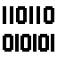
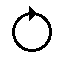
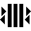
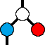
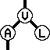
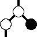
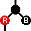

# [gsdk](../../README.md) > core

| collections | *array* | *bitmap* | *cache* | *dict* | *hash table* | *set* | *tuple* |
| ----------- | ---- | ---| --- | --- | ---- | --- | ------ |
| |  | |  |  |  |  |  |
| mutable         | ✔️ | ✔️ | ✔️ | ✔️ | ✔️ | ❌ | ❌ | 
| iterable        | ✔️ | ✔️ | ✔️ | ✔️ | ✔️ | ✔️ | ✔️ |
| integer indexed | ✔️ | ✔️ | ❌ | ❌ | ❌ | ❌ | ✔️ |
| reflection      | ✔️ | ✔️ | ✔️ | ✔️ | ✔️ | ✔️ | ✔️ |

| streams | *circular_buffer* | *double_queue* | *priority_queue* | *queue* | *stack* |
| - | --- | --- | ---- | --- | --- |
| |  |  |  |  | |  
| LIFO          | ✔️ | ✔️ | ❌ | ❌ | ✔️ |
| FIFO          | ✔️ | ✔️ | ✔️ | ✔️ | ❌ |
| Key Accessor  | ❌ | ❌ | ✔️ | ❌ | ❌ |
| Comparator    | ❌ | ❌ | ✔️ | ❌ | ❌ |

| tree | *avl* | *binary* | *red black* |
| ---- | ----- | -------- | -------- |
|  |  |  |  |

| node | graph | table |
| ---- | --- | ---- | 
|  |  |  
